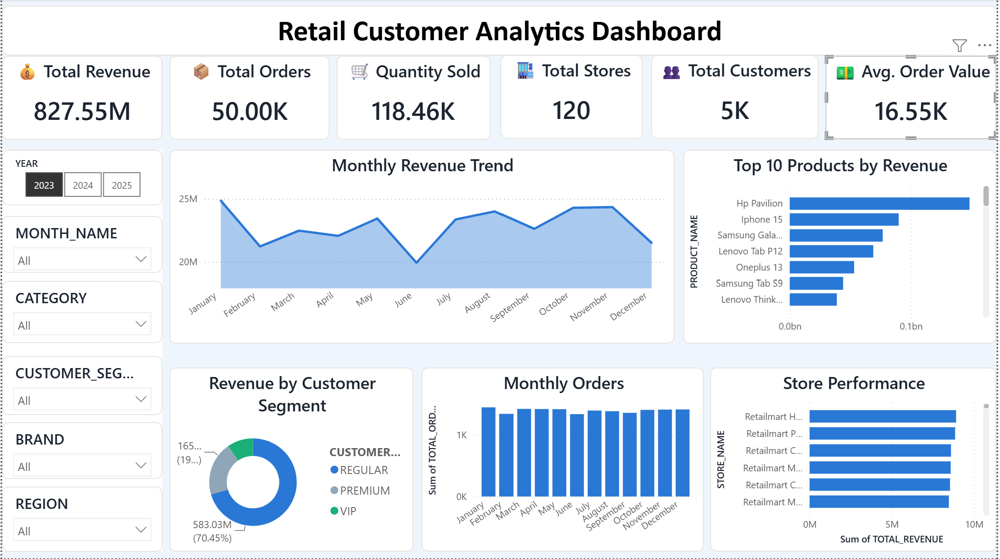
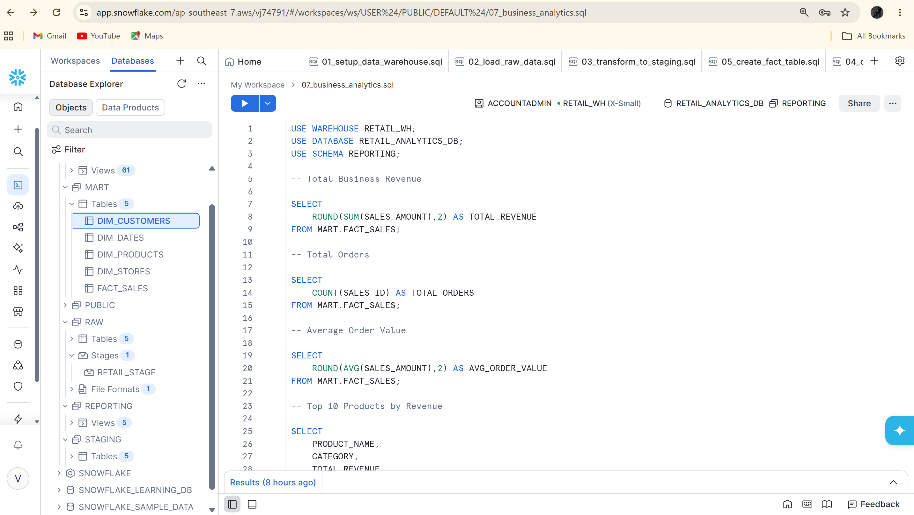
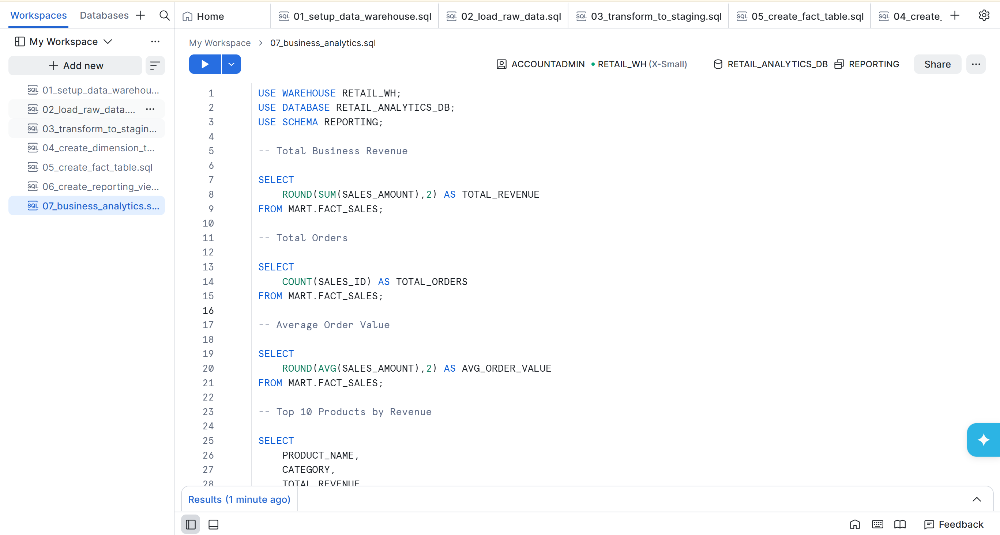
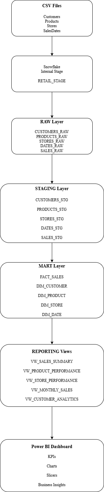
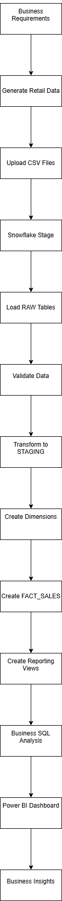
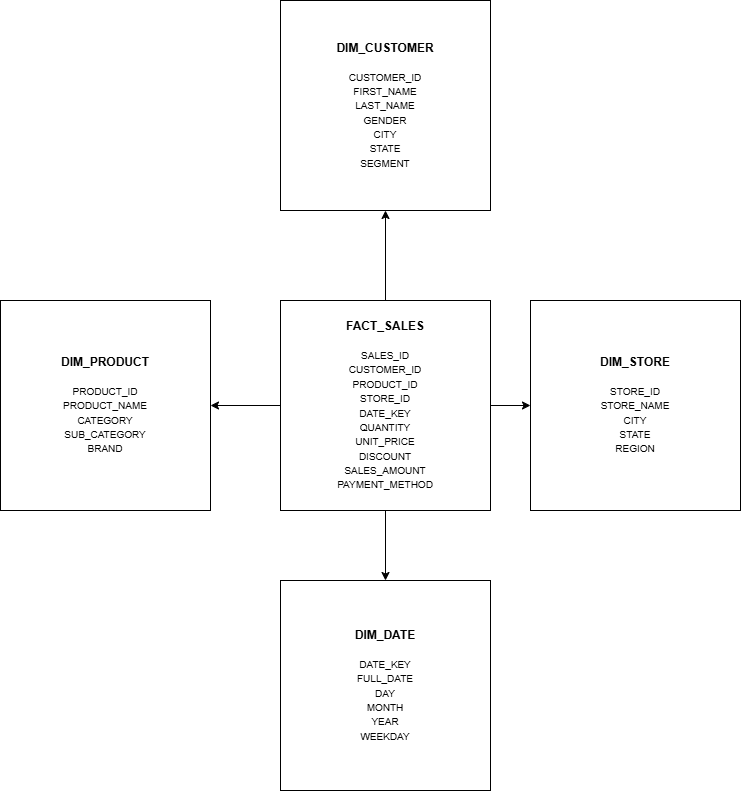

# Customer Analytics Data Warehouse

Dashboard Link: https://app.powerbi.com/groups/me/reports/7c1c18f4-d0cf-4277-955d-999fa1ea6210/412d1c2fa296884c864b?experience=power-bi

An end-to-end data warehousing and business intelligence project built using **Snowflake, SQL, Python, and Power BI**. The project demonstrates how retail sales data can be transformed into meaningful business insights through a modern analytics pipeline.

---

## Project Overview

Retail businesses generate large volumes of sales transactions every day from multiple stores and online channels. Managing this data in separate files often leads to inconsistent reporting, manual effort, and delayed business decisions.

This project builds a centralized analytics platform that ingests retail sales data into Snowflake, transforms it into a structured data warehouse using a multi-layer architecture, and delivers interactive dashboards through Power BI.

The solution follows industry-standard data warehousing practices using the **RAW → STAGING → MART → REPORTING** architecture.

---

## Business Problem

The organization faced several reporting challenges:

- Sales data was stored across multiple CSV files.
- Business reports were prepared manually.
- Different teams generated different KPI values.
- There was no centralized analytics platform.
- Data quality validation was missing.
- Decision-making was slow due to inconsistent reporting.

---

## Solution

The project implements an end-to-end analytics solution that:

- Generates retail business datasets using Python
- Loads data into Snowflake
- Cleans and transforms raw data
- Builds Fact and Dimension tables
- Creates Reporting Views for analytics
- Generates business KPIs using SQL
- Visualizes insights using Power BI

---

# Architecture

```
CSV Files
     │
     ▼
Snowflake Internal Stage
     │
     ▼
RAW Layer
     │
     ▼
STAGING Layer
     │
     ▼
MART Layer
(Fact & Dimensions)
     │
     ▼
REPORTING Views
     │
     ▼
Power BI Dashboard
```

---

# Project Structure

```
Customer_Analytics_Data_Warehouse/
│
├── data/
│   ├── customers.csv
│   ├── products.csv
│   ├── stores.csv
│   ├── sales.csv
│   └── dates.csv
│
├── python/
│   └── generate_data.py
│
├── sql/
│   ├── 01_setup_data_warehouse.sql
│   ├── 02_load_raw_data.sql
│   ├── 03_transform_to_staging.sql
│   ├── 04_create_dimension_tables.sql
│   ├── 05_create_fact_sales.sql
│   ├── 06_create_reporting_views.sql
│   └── 07_business_analytics.sql
│
├── powerbi/
│   └── Customer_Analytics_Dashboard.pbix
│
├── docs/
│   ├── architecture.png
│   ├── star_schema.png
│   ├── workflow.png
│   ├── dashboard.png
│   ├── snowflake_database.png
│   ├── fact_sales.png
│   └── business_queries.png
│
├── business_requirements.md
├── README.md
├── requirements.txt
├── LICENSE
└── .gitignore
```

---

# Technology Stack

| Technology | Purpose |
|------------|---------|
| Python | Data Generation |
| Snowflake | Cloud Data Warehouse |
| SQL | ETL, Data Transformation & Analytics |
| Power BI | Dashboard & Visualization |
| Git & GitHub | Version Control |

---

# Data Warehouse Layers

## RAW Layer

Stores the original data loaded from CSV files without modification.

Tables:

- CUSTOMERS_RAW
- PRODUCTS_RAW
- STORES_RAW
- SALES_RAW
- DATES_RAW

---

## STAGING Layer

Performs data cleaning and standardization.

Examples:

- Remove null records
- Trim spaces
- Standardize text formatting
- Round numeric values
- Validate business data

Tables:

- CUSTOMERS_STG
- PRODUCTS_STG
- STORES_STG
- SALES_STG
- DATES_STG

---

## MART Layer

Implements a Star Schema for analytical reporting.

Fact Table

- FACT_SALES

Dimension Tables

- DIM_CUSTOMER
- DIM_PRODUCT
- DIM_STORE
- DIM_DATE

---

## REPORTING Layer

Business-ready views used directly in Power BI.

Views:

- VW_SALES_SUMMARY
- VW_PRODUCT_PERFORMANCE
- VW_STORE_PERFORMANCE
- VW_MONTHLY_SALES
- VW_CUSTOMER_ANALYTICS

---

# ETL Workflow

1. Generate retail datasets using Python.
2. Upload CSV files into Snowflake Stage.
3. Load data into RAW tables.
4. Transform data into STAGING tables.
5. Create Fact and Dimension tables.
6. Build Reporting Views.
7. Perform business analytics using SQL.
8. Create interactive Power BI dashboards.

---

# Star Schema

```
             DIM_CUSTOMER
                  │
                  │
DIM_PRODUCT ─ FACT_SALES ─ DIM_STORE
                  │
                  │
               DIM_DATE
```

---

# Business KPIs

The dashboard provides insights into:

- Total Revenue
- Total Orders
- Total Customers
- Total Quantity Sold
- Average Order Value
- Store Performance
- Product Performance
- Monthly Revenue Trends
- Customer Segmentation

---

# Power BI Dashboard

The dashboard includes:

- Executive KPI Cards
- Monthly Revenue Trend
- Monthly Orders Analysis
- Top Products
- Store Performance
- Revenue by Category
- Customer Segmentation
- Interactive Slicers

> Dashboard Screenshot



---

# Sample Business Questions

The project answers questions such as:

- Which products generate the highest revenue?
- Which stores perform best?
- Which customer segments contribute the most revenue?
- How does revenue change month over month?
- Which product categories are growing?
- What is the average order value?
- Which regions generate the highest sales?

---

# Key Features

- End-to-End Data Warehouse
- Snowflake Multi-Layer Architecture
- SQL Data Transformation
- Star Schema Design
- Business Reporting Views
- Interactive Power BI Dashboard
- KPI Reporting
- Business Analytics
- Professional Project Documentation

---

# Screenshots

## Snowflake Database



---

## Fact Table


---

## Business Analytics Queries



---

## Architecture



---

## Workflow



---

## Star Schema



---

# Future Enhancements

- Incremental Data Loading
- Automated ETL Pipelines
- REST API Data Ingestion
- Data Quality Monitoring
- Customer Segmentation using Machine Learning
- Sales Forecasting
- Scheduled Snowflake Tasks
- CI/CD Deployment

---

# Author

**Vijay Kumar Dandu**

- GitHub: https://github.com/vijaykumardandu
- LinkedIn: https://www.linkedin.com/in/vijaykumar841

---

# License

This project is licensed under the MIT License.
